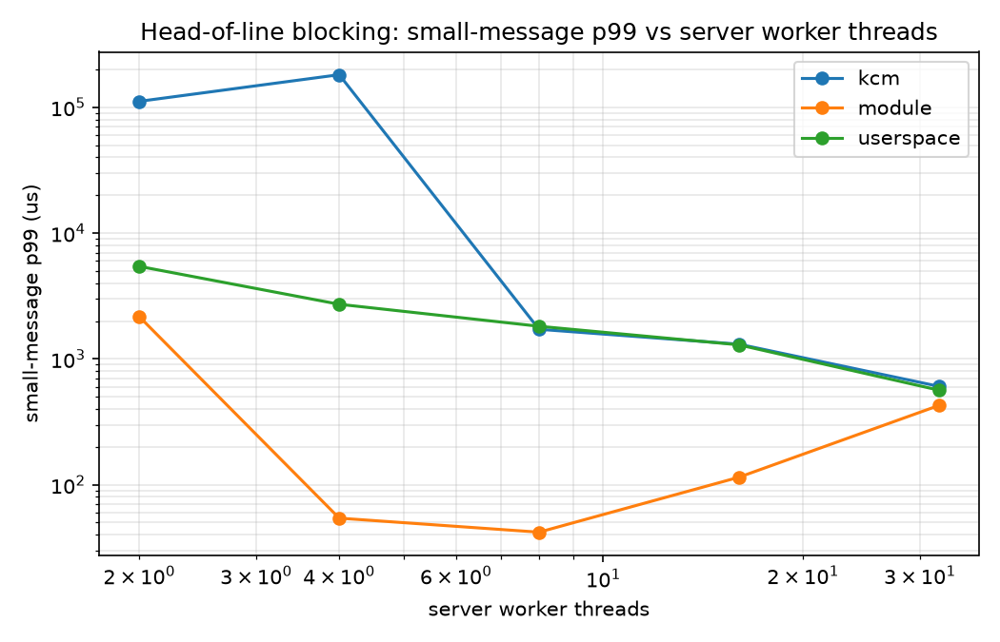
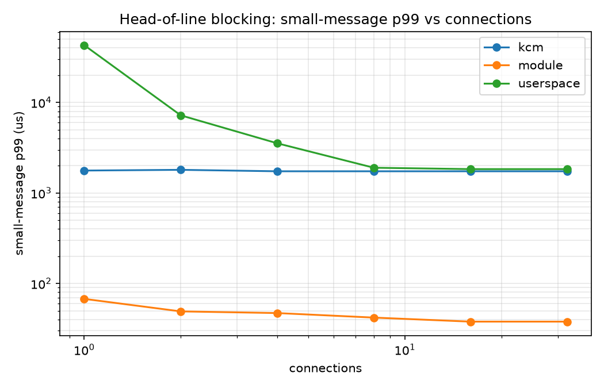

# KDispatch

**In-kernel, TCP-aware message dispatch for RPCs**

TCP gives byte stream, not messages. RPC frameworks therefore reassemble
message boundaries in userspace, on I/O threads that own a shard of the
connections. That couples *reassembly* to *execution*: a worker busy with one
large message cannot serve a small message that is already complete on another
connection in its shard. This results in head-of-line (HOL) blocking, and it gets
worse as connections-per-worker grows.

KDispatch measures that effect and compares three ways of getting messages from
the wire to a worker thread.

| Arm | What it does |
| --- | --- |
| **A — userspace** | epoll server, per-connection reassembly, workers sharded by connection (what gRPC-style stacks do) |
| **B — KCM** | Linux `AF_KCM` + an eBPF length-prefix parser; the kernel delivers whole messages, any worker can take any message |
| **C — module** | custom kernel module on `strparser` with a single shared, work-conserving message queue |

Scoped-down exploration of
[*Rakaia: Scalable In-Kernel Scheduling for TCP-Based RPCs*](https://www.usenix.org/conference/osdi26/technical-sessions)
(Yang, Prasopoulos, Bugnion — EPFL, OSDI '26).

KDispatch implements the paper's core mechanism — recover message boundaries in
the kernel's TCP receive path, then dispatch each completed message
work-conservingly to whichever worker is free — and measures it against both
baselines the paper uses.

### What is implemented, and what is not

`module/kdispatch.c` hooks `sk_data_ready` and runs `strparser` in the TCP
receive path, so parsing happens where the paper puts it. Completed messages go
onto a single shared queue that any worker can pull from, so no worker is bound
to a connection. That is the mechanism the results below measure.

It is **not** a reimplementation. What Rakaia has and this does not:

| | Rakaia | KDispatch |
| --- | --- | --- |
| Message framing in the TCP receive path | yes | yes |
| Work-conserving dispatch | yes | yes |
| Scheduling across many cores | per-core scheduling | **one global queue behind one spinlock** |
| Send path | messages both ways; userspace never sees TCP | **receive only** — userspace still holds the fds and `write()`s replies |
| Encrypted traffic | kTLS | **not supported** |
| Baseline compared against | patched gRPC-Go / gRPC-C++ | **a model** of gRPC's architecture, written here |
| Workload | Silo/TPC-C, OpenTelemetry Collector | **synthetic** RPCs with a calibrated busy-spin |

The scalability row is the one that shows up in the numbers: a single shared
queue is a single contention point, which is why arm C is fastest at 8 workers
and gets worse at 32. See
[Arm C is fastest in the middle](#arm-c-is-fastest-in-the-middle-and-that-is-not-a-bug).

kTLS is left out deliberately rather than for lack of time: it decides whether
the approach works on *encrypted* production traffic (TLS terminated in
userspace would leave the kernel staring at ciphertext, unable to find any
message boundary at all), but it is orthogonal to head-of-line blocking and
would not move any number in the tables below.

## Results

Workload: 128 B / 10 µs "small" RPCs, with 1% "large" ones carrying an identical
128 B payload but 2 ms of service time. Equal payloads on purpose - that isolates
**dispatch** from byte movement, so what is measured is scheduling, not copying.
32 connections, 30k msg/s offered, 5 s runs, median of 3 repeats. Every run
reconciles exactly (`sent == recvd`), with no parser aborts or desyncs.



Small-message p99, in µs:

| workers | A userspace | B KCM | **C module** | **A/C** | **B/C** |
| --- | --- | --- | --- | --- | --- |
| 2 | 5440 | 111608 | 2163 | 2.5× | 51.6× |
| 4 | 2720 | 181633 | **54** | **50.1×** | 3347× |
| 8 | 1819 | 1720 | **42** | **43.3×** | 41.0× |
| 16 | 1294 | 1311 | **115** | 11.3× | 11.4× |
| 32 | 565 | 606 | 426 | 1.3× | 1.4× |

### A shared queue removes head-of-line blocking; in-kernel framing alone does not

The headline: **arm A needs 32 worker threads to reach 565 µs p99. Arm C reaches
54 µs with 4** — an order of magnitude better latency on an eighth of the
threads, and **50× at equal thread count**.

The three arms differ only in how a completed message reaches a worker:

- **A** binds a worker to a shard of connections. A worker running a slow RPC
  cannot serve a fast message waiting on another connection in its shard.
- **B** moves parsing into the kernel but reserves a KCM socket per connection
  while a message is outstanding, so the same coupling survives. Measured: KCM
  tracks the userspace baseline within 5% once workers are plentiful, and
  collapses when they are scarce.
- **C** binds nothing. Every completed message from every connection lands on one
  queue and any idle worker takes the head.

So framing is not what governs the tail — **dispatch policy is**. That is exactly
the gap Rakaia identifies when it reports up to 5× higher throughput-under-SLO
than KCM, reproduced here from scratch.

### Throughput-under-SLO

The metric Rakaia reports, so the one that makes these results comparable in kind
to the paper's: the highest offered load at which small-message p99 stays under a
target. Found by binary search on offered rate (`scripts/slo_ladder.sh`), where a
rate passes only if p99 meets the SLO **and** the generator kept its schedule
(achieved >= 95% of offered) **and** no messages were lost — otherwise the number
would describe the load generator rather than the server.

SLO = 500 µs p99, 32 connections, 8 workers, 11-step search (converged to ~1%):

| arm | throughput-under-SLO | vs userspace |
| --- | --- | --- |
| A userspace | 6,856 msg/s | — |
| B KCM | 7,439 msg/s | 1.09× |
| **C module** | **115,878 msg/s** | **16.9×** |

Arm C sustains **16.9× the load** of the userspace baseline and **15.6× KCM's**
at the same tail-latency target. KCM's 1.09× over userspace is the same null
result the latency numbers show, expressed as throughput.

### Head-of-line blocking within a single connection

The paper notes that a stream API induces HOL blocking *within* a connection as
well as across connections. Driving all load down one connection isolates that:
with 8 workers available, arm A can use exactly one of them, because a worker
owns the connection.



Small-message p99 at fixed 8 workers, 30k msg/s, varying how many connections
the load is spread over:

| conns | A userspace | B KCM | **C module** | A/C | B/C |
| --- | --- | --- | --- | --- | --- |
| 1 | 42992 µs | 1770 µs | **63 µs** | **677×** | 28× |
| 2 | 7209 µs | 1770 µs | **52 µs** | 138× | 34× |
| 4 | 3539 µs | 1737 µs | **44 µs** | 80× | 39× |
| 8 | 2032 µs | 1737 µs | **45 µs** | 45× | 39× |
| 16 | 1901 µs | 1704 µs | **41 µs** | 46× | 42× |
| 32 | 1835 µs | 1737 µs | **42 µs** | 44× | 41× |

Three distinct behaviours:

- **Arm A is connection-count bound.** One connection means one usable worker, so
  p99 is 43 ms; spreading the same load over 32 connections recovers most of it.
  The parallelism available to the application is capped by how the client
  happens to shard its traffic.
- **KCM is flat at ~1740 µs and never better.** It does fix the single-connection
  case (1770 µs versus 43 ms), because it releases its reservation once userspace
  has received the message, so one connection's messages can reach several
  workers. But it never approaches the module at any connection count.
- **Arm C is flat at 41–63 µs**, which is essentially its own p50. Blocking is
  gone in both directions, and performance no longer depends on client sharding.

### KCM drops messages at low connection counts

Across four independent sweeps, the KCM arm loses messages - 343 at 1 connection,
400 at 2, 414 at several worker counts - always at low connection counts, never
in arm A or arm C, with no counter in `/proc/net/kcm_stats` reporting a drop and
no parser abort. Reproducible, but the mechanism is not identified here. Any KCM
latency figure at those points should be read as "KCM misbehaves" rather than as
a clean measurement.

### Arm C is fastest in the middle, and that is not a bug

Arm C's curve is U-shaped: best at 8 workers (42 µs), worse at 32 (426 µs). One
shared queue means one contention point — past the number of workers needed to
keep the queue drained, extra threads add lock traffic and scheduler wakeups
without adding useful concurrency. Queue depth confirms it: the high-water mark
is 4–9 messages at 8+ workers versus ~130 at 2 workers, so by 8 workers the queue
is already empty most of the time and there is nothing left for more threads to
do. Rakaia's per-core scheduling is the answer to this; a single global queue is
not meant to scale to arbitrary worker counts.

### Two undocumented buffer ceilings in KCM

Getting arm B to run at all meant discovering that a message must fit in *two*
independent receive buffers:

1. **The transport socket's `sk_rcvbuf`.** `strparser` rejects anything longer
   with `EMSGSIZE` and **aborts the connection** - it does not degrade, it dies.
   With the stock `net.ipv4.tcp_rmem` default of 131072, every message above
   ~128 KB kills its connection.
2. **The KCM socket's own `sk_rcvbuf`.** Completed messages are queued against
   it. If a message does not fit, delivery **wedges silently** - no counter in
   `/proc/net/kcm_stats` increments, and the sender simply blocks forever in
   `write()`.

Both servers now size both buffers and refuse to start a run that cannot complete.

### A parser bug worth recording

Arm C initially failed one run in ten: workers pinned at 99.98% CPU having handled
three messages each. They were spinning on a garbage `work_us` decoded from a
misaligned header.

`kd_parse_msg` read the length prefix at offset 0, but `strparser` passes a head
skb that may still contain the *preceding* message, with this one starting at
`strp_msg(skb)->offset`. Delivery honoured that offset; parsing did not. When
messages arrived coalesced — reliably at attach time, when a backlog is already
buffered — the parser decoded the previous message's header.

The module now parses at `->offset`, and carries a permanent invariant check: the
length prefix at the delivery offset must equal `full_len`, or the message is
dropped and counted in `desync` rather than handed to userspace. 15/15 runs
report `desync=0`.

### Arm A, for reference

Sweeping the large-message fraction at 32 connections / 4 workers, with 256 KB
large payloads (the earlier workload, before payloads were equalized):

| large% | p50 | p99 | p99.9 |
| --- | --- | --- | --- |
| 0.1% | 27.1 µs | 688 µs | 2.00 ms |
| 1% | 29.2 µs | 2.95 ms | 5.24 ms |
| 4% | 1.08 ms | 14.7 ms | 23.6 ms |

Connection count on its own is a flat axis for arm A: at fixed aggregate rate and
worker count, adding connections does not change how often a small message lands
behind a large one. Kept as a control.

## Layout

```
include/proto.hpp          wire format (length-prefixed, BPF-parseable header)
include/hist.hpp           log-bucketed latency histogram, ~3% relative precision
include/netutil.hpp        socket tuning shared by every arm
include/server_stats.hpp   per-worker accounting, identical JSON across arms
include/kdispatch_uapi.h   device ABI shared by the module and its server

src/loadgen.cpp            open-loop generator + reply reader
src/server_userspace.cpp   arm A - userspace reassembly, workers sharded by connection
src/server_kcm.cpp         arm B - AF_KCM + BPF stream parser
src/server_module.cpp      arm C - reads whole messages from /dev/kdispatch

bpf/kcm_parser.bpf.c       arm B's parser in readable C (the server emits it as bytecode)
module/kdispatch.c         work-conserving in-kernel dispatcher
module/Makefile            Kbuild for the module

scripts/setcap.sh          grant server_kcm CAP_BPF (re-run after every rebuild)
scripts/load_module.sh     build + insmod the module, or unload it
scripts/smoke_kcm.sh       arms A and B side by side at one operating point
scripts/run_sweep.sh       sweep one axis for one arm
scripts/slo_ladder.sh      binary search for throughput-under-SLO
scripts/plot.py            graphs from a directory of result JSON

plots/                     committed figures used by this README
```

Result JSON is written to `results/` (or whatever `OUTDIR` names) and is not
tracked - regenerate it with the commands under [Running](#running).

## Requirements

| | |
| --- | --- |
| OS | Linux with `CONFIG_AF_KCM=m` and `CONFIG_STREAM_PARSER=y` |
| Compiler | C++23 (GCC 13+ or Clang 16+), CMake ≥ 3.20 |
| Arm B | `libcap` tools (`setcap`/`getcap`), and `CAP_BPF` to load the parser |
| Arm C | kernel headers matching the running kernel |
| Plots | Python 3 with `matplotlib` |

No `clang` or `libbpf` needed: arm B's stream parser is three instructions,
emitted directly through `bpf(2)`. `bpf/kcm_parser.bpf.c` is the readable
equivalent, kept for documentation.

```bash
sudo apt install -y build-essential cmake linux-headers-$(uname -r) \
                    libcap2-bin python3-matplotlib
```

## Setup

**1. Check the kernel supports what the arms need.**

```bash
grep -E 'CONFIG_AF_KCM|CONFIG_STREAM_PARSER' /boot/config-$(uname -r)
sudo modprobe kcm && lsmod | grep kcm
```

Want `CONFIG_AF_KCM=m` and `CONFIG_STREAM_PARSER=y`. If `AF_KCM` is missing,
arms A and C still work; arm B does not.

**2. Build the userspace binaries.**

```bash
cmake -S . -B build -DCMAKE_BUILD_TYPE=Release && cmake --build build -j
```

**3. Grant arm B its capability.** Loading a socket filter needs `CAP_BPF`.
File capabilities live on the inode, so **this must be re-run after every
rebuild that relinks `server_kcm`**:

```bash
sudo scripts/setcap.sh
./build/server_kcm --check-bpf      # expect: BPF stream parser loaded OK
```

**4. Build and load the arm C module.** It creates `/dev/kdispatch` mode 0666,
so the server itself runs unprivileged:

```bash
sudo scripts/load_module.sh
```

**5. For real measurements**, pin the clock — otherwise DVFS shows up in the
tails:

```bash
sudo cpupower frequency-set -g performance
echo 1 | sudo tee /sys/devices/system/cpu/intel_pstate/no_turbo
```

**Teardown:**

```bash
sudo scripts/load_module.sh unload
```

## Running

**One arm by hand:**

```bash
mkdir -p results
./build/server_module --port 9000 --workers 8 --out results/srv.json &
./build/loadgen --port 9000 --conns 32 --threads 8 --rate 30000 \
                --duration 5 --warmup 1 --large-pct 1 \
                --large-size 128 --large-work-us 2000 \
                --arm module --out results/run.json
kill %1
```

Swap `server_module` for `server_userspace` (arm A) or `server_kcm` (arm B).

**Side-by-side smoke test** (arms A and B at one operating point):

```bash
scripts/smoke_kcm.sh
```

**Sweeps.** One axis, one arm, JSON per run into `results/`:

```bash
scripts/run_sweep.sh <arm> <axis>     # arm: userspace | kcm | module
```

| axis | values swept | what it shows |
| --- | --- | --- |
| `workers` | 2…32 threads | how much parallelism each design needs |
| `conns` | 1…32 connections | HOL blocking within vs across connections |
| `large_pct` | 0.1…4% | sensitivity to slow-request mix |
| `rate` | 10k…120k msg/s | load/latency curve |
| `large_size` | 16 KB…384 KB | the `strparser`/`sk_rcvbuf` ceiling |

Fixed points are set by environment variables, so the swept axis is the only
thing that varies:

```bash
CONNS=32 RATE=30000 WORKERS=8 DURATION=5 WARMUP=1 \
LARGE_PCT=1 LARGE_SIZE=128 LARGE_WORK_US=2000 REPEATS=3 \
  scripts/run_sweep.sh module workers
```

**Throughput-under-SLO** — binary search for the highest load meeting a p99
target:

```bash
SLO_US=500 CONNS=32 WORKERS=8 STEPS=11 scripts/slo_ladder.sh module
```

**Plots.** Detects the varying axis and overlays every arm present:

```bash
python3 scripts/plot.py results/ -o figs/
```

### Reproducing the tables above

```bash
# workers sweep, all three arms  ->  the headline graph
for arm in userspace kcm module; do
  CONNS=32 RATE=30000 DURATION=5 WARMUP=1 LARGE_PCT=1 \
  LARGE_SIZE=128 LARGE_WORK_US=2000 VALUES="2 4 8 16 32" REPEATS=3 \
    scripts/run_sweep.sh $arm workers
done
python3 scripts/plot.py results/ -o figs/

# connection sweep  ->  within- vs across-connection blocking
for arm in userspace kcm module; do
  WORKERS=8 RATE=30000 DURATION=4 WARMUP=1 LARGE_PCT=1 \
  LARGE_SIZE=128 LARGE_WORK_US=2000 VALUES="1 2 4 8 16 32" REPEATS=1 \
  OUTDIR=results_conns scripts/run_sweep.sh $arm conns
done
python3 scripts/plot.py results_conns/ -o figs_conns/

# throughput-under-SLO
for arm in userspace kcm module; do
  SLO_US=500 CONNS=32 WORKERS=8 STEPS=11 scripts/slo_ladder.sh $arm
done
```

## Troubleshooting

| symptom | cause and fix |
| --- | --- |
| `BPF_PROG_LOAD failed: Operation not permitted` | `EPERM` — missing `CAP_BPF`. Run `sudo scripts/setcap.sh`; a rebuild clears it. |
| `BPF_PROG_LOAD failed: Permission denied` | `EACCES` — the *verifier* rejected the program. `sudo` will not help; read the verifier log printed beneath. |
| `open /dev/kdispatch: No such file` | module not loaded — `sudo scripts/load_module.sh`. It does not survive a reboot. |
| `bind: Address already in use` | a server from an earlier run is still holding the port. Find it with `ss -ltnp` and kill it by PID. |
| `--large-size N exceeds the achievable sk_rcvbuf` | raise `net.core.rmem_max`, or lower `--large-size`. See the buffer-ceiling section above. |
| results files unwritable after a `sudo` run | they are owned by root; `sudo chown -R $USER results/`. |
| a server ignores `SIGTERM` | known: a worker can block in a reply `write()`. The sweep scripts escalate to `SIGKILL` after 6 s. |

## Measurement notes

The numbers are only worth anything if the rig is honest, so:

- **Open loop.** The generator sends on a fixed-rate schedule with exponential
  gaps, never "next request after previous reply". Closed-loop generators
  throttle themselves exactly when the server is struggling and erase the tail
  — coordinated omission.
- **Two latencies per message.** `small` measures from the actual `write()`;
  `small_ol` measures from the *scheduled* send time. When the generator itself
  falls behind, these diverge and `sched_delay` says by how much. Graphs use the
  `_ol` numbers.
- **Warmup discarded** (default 5 s), reported in every result file.
- **Work is spun, not slept.** Sleeping would hand the core back to the
  scheduler and hide the blocking under test.
- **Worker busy% spread** (max − min across workers) is the direct evidence for
  work conservation: a sharded design leaves workers idle while messages queue.

For real runs, pin the cores and fix the clock:

```bash
sudo cpupower frequency-set -g performance
echo 1 | sudo tee /sys/devices/system/cpu/intel_pstate/no_turbo
```
