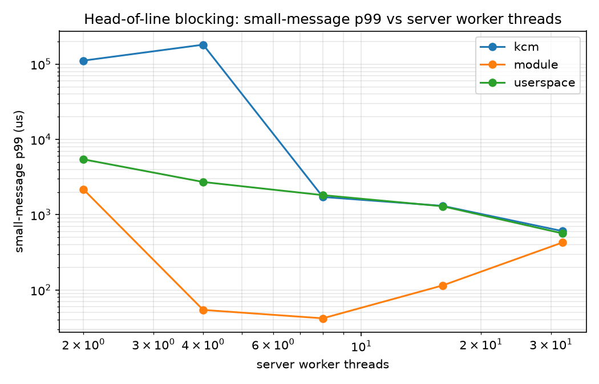

# KDispatch

**In-kernel, TCP-aware message dispatch for RPCs — and a measurement rig that shows why it matters.**

TCP gives you a byte stream, not messages. RPC frameworks therefore reassemble
message boundaries in userspace, on I/O threads that own a shard of the
connections. That couples *reassembly* to *execution*: a worker busy with one
large message cannot serve a small message that is already complete on another
connection in its shard. The result is head-of-line (HOL) blocking, and it gets
worse as connections-per-worker grows.

KDispatch measures that effect and compares three ways of getting messages from
the wire to a worker thread.

| Arm | What it does | Status |
| --- | --- | --- |
| **A — userspace** | epoll server, per-connection reassembly, workers sharded by connection (what gRPC-style stacks do) | done |
| **B — KCM** | Linux `AF_KCM` + an eBPF length-prefix parser; the kernel delivers whole messages, any worker can take any message | done |
| **C — module** | custom kernel module on `strparser` with a single shared, work-conserving message queue | done |

Scoped-down exploration of ideas from
[*Rakaia: Scalable In-Kernel Scheduling for TCP-Based RPCs*](https://www.usenix.org/conference/osdi26/technical-sessions)
(Yang, Prasopoulos, Bugnion — EPFL, OSDI '26). This is not a reimplementation:
Rakaia does work-conserving scheduling in the TCP receive path with kTLS support
and a patched gRPC. KDispatch reproduces the *problem*, measures how far the existing in-kernel
message API gets you, and implements a minimal work-conserving dispatcher to
close the gap.

## Results

Workload: 128 B / 10 µs "small" RPCs, with 1% "large" ones carrying an identical
128 B payload but 2 ms of service time. Equal payloads on purpose — that isolates
**dispatch** from byte movement, so what is measured is scheduling, not copying.
32 connections, 30k msg/s offered, 5 s runs, median of 3 repeats. Every run
reconciles exactly (`sent == recvd`), with no parser aborts or desyncs.



Small-message p99, in µs:

| workers | A userspace | B KCM | **C module** | **A/C** | **B/C** |
| --- | --- | --- | --- | --- | --- |
| 2 | 5440 | 111608 | 2163 | 2.5× | 51.6× |
| 4 | 2720 | 181633 | **54** | **50.1×** | 3347× |
| 8 | 1819 | 1720 | **42** | **43.3×** | 41.0× |
| 16 | 1294 | 1311 | **115** | 11.3× | 11.4× |
| 32 | 565 | 606 | 426 | 1.3× | 1.4× |

### A shared queue removes head-of-line blocking; in-kernel framing alone does not

The headline: **arm A needs 32 worker threads to reach 565 µs p99. Arm C reaches
54 µs with 4** — an order of magnitude better latency on an eighth of the
threads, and **50× at equal thread count**.

The three arms differ only in how a completed message reaches a worker:

- **A** binds a worker to a shard of connections. A worker running a slow RPC
  cannot serve a fast message waiting on another connection in its shard.
- **B** moves parsing into the kernel but reserves a KCM socket per connection
  while a message is outstanding, so the same coupling survives. Measured: KCM
  tracks the userspace baseline within 5% once workers are plentiful, and
  collapses when they are scarce.
- **C** binds nothing. Every completed message from every connection lands on one
  queue and any idle worker takes the head.

So framing is not what governs the tail — **dispatch policy is**. That is exactly
the gap Rakaia identifies when it reports up to 5× higher throughput-under-SLO
than KCM, reproduced here from scratch.

### Arm C is fastest in the middle, and that is not a bug

Arm C's curve is U-shaped: best at 8 workers (42 µs), worse at 32 (426 µs). One
shared queue means one contention point — past the number of workers needed to
keep the queue drained, extra threads add lock traffic and scheduler wakeups
without adding useful concurrency. Queue depth confirms it: the high-water mark
is 4–9 messages at 8+ workers versus ~130 at 2 workers, so by 8 workers the queue
is already empty most of the time and there is nothing left for more threads to
do. Rakaia's per-core scheduling is the answer to this; a single global queue is
not meant to scale to arbitrary worker counts.

### Two undocumented buffer ceilings in KCM

Getting arm B to run at all meant discovering that a message must fit in *two*
independent receive buffers:

1. **The transport socket's `sk_rcvbuf`.** `strparser` rejects anything longer
   with `EMSGSIZE` and **aborts the connection** — it does not degrade, it dies.
   With the stock `net.ipv4.tcp_rmem` default of 131072, every message above
   ~128 KB kills its connection.
2. **The KCM socket's own `sk_rcvbuf`.** Completed messages are queued against
   it. If a message does not fit, delivery **wedges silently** — no counter in
   `/proc/net/kcm_stats` increments, and the sender simply blocks forever in
   `write()`.

Both servers now size both buffers and refuse to start a run that cannot complete.

### A parser bug worth recording

Arm C initially failed one run in ten: workers pinned at 99.98% CPU having handled
three messages each. They were spinning on a garbage `work_us` decoded from a
misaligned header.

`kd_parse_msg` read the length prefix at offset 0, but `strparser` passes a head
skb that may still contain the *preceding* message, with this one starting at
`strp_msg(skb)->offset`. Delivery honoured that offset; parsing did not. When
messages arrived coalesced — reliably at attach time, when a backlog is already
buffered — the parser decoded the previous message's header.

The module now parses at `->offset`, and carries a permanent invariant check: the
length prefix at the delivery offset must equal `full_len`, or the message is
dropped and counted in `desync` rather than handed to userspace. 15/15 runs
report `desync=0`.

### Arm A, for reference

Sweeping the large-message fraction at 32 connections / 4 workers, with 256 KB
large payloads (the earlier workload, before payloads were equalized):

| large% | p50 | p99 | p99.9 |
| --- | --- | --- | --- |
| 0.1% | 27.1 µs | 688 µs | 2.00 ms |
| 1% | 29.2 µs | 2.95 ms | 5.24 ms |
| 4% | 1.08 ms | 14.7 ms | 23.6 ms |

Connection count on its own is a flat axis for arm A: at fixed aggregate rate and
worker count, adding connections does not change how often a small message lands
behind a large one. Kept as a control.

## Layout

```
include/proto.hpp   wire format (length-prefixed, BPF-parseable header)
include/hist.hpp    log-bucketed latency histogram, ~3% relative precision
src/server_userspace.cpp   arm A
src/loadgen.cpp            open-loop generator + reply reader
src/server_kcm.cpp         arm B
src/server_module.cpp      arm C
bpf/kcm_parser.bpf.c       KCM stream parser, reference form
module/kdispatch.c         work-conserving in-kernel dispatcher
include/kdispatch_uapi.h   device ABI shared by module and server
scripts/run_sweep.sh       connection-count sweep
scripts/plot.py            graphs from results/*.json
```

## Build and run

```bash
cmake -S . -B build -DCMAKE_BUILD_TYPE=Release && cmake --build build -j
```

Arm B loads a BPF stream parser, which needs `CAP_BPF`. Grant it once per build
(file capabilities live on the inode, so any relink clears them):

```bash
sudo scripts/setcap.sh
./build/server_kcm --check-bpf        # should print "loaded OK"
```

Arm C needs the kernel module loaded (rebuilds and `insmod`s; creates
`/dev/kdispatch` mode 0666, so the server itself runs unprivileged):

```bash
sudo scripts/load_module.sh
sudo scripts/load_module.sh unload   # when done
```

Side-by-side comparison at one operating point, and the full sweep:

```bash
scripts/smoke_kcm.sh
scripts/run_sweep.sh module workers
python3 scripts/plot.py results/ -o figs/
```

Full sweep and graphs:

```bash
scripts/run_sweep.sh userspace
python3 scripts/plot.py results/ -o figs/
```

## Measurement notes

The numbers are only worth anything if the rig is honest, so:

- **Open loop.** The generator sends on a fixed-rate schedule with exponential
  gaps, never "next request after previous reply". Closed-loop generators
  throttle themselves exactly when the server is struggling and erase the tail
  — coordinated omission.
- **Two latencies per message.** `small` measures from the actual `write()`;
  `small_ol` measures from the *scheduled* send time. When the generator itself
  falls behind, these diverge and `sched_delay` says by how much. Graphs use the
  `_ol` numbers.
- **Warmup discarded** (default 5 s), reported in every result file.
- **Work is spun, not slept.** Sleeping would hand the core back to the
  scheduler and hide the blocking under test.
- **Worker busy% spread** (max − min across workers) is the direct evidence for
  work conservation: a sharded design leaves workers idle while messages queue.

For real runs, pin the cores and fix the clock:

```bash
sudo cpupower frequency-set -g performance
echo 1 | sudo tee /sys/devices/system/cpu/intel_pstate/no_turbo
```

## Requirements

- Linux with `CONFIG_AF_KCM=m` and `CONFIG_STREAM_PARSER=y` (needed for arm B)
- C++23 compiler, CMake ≥ 3.20
- clang + libbpf for the arm B parser
- kernel headers for arm C
